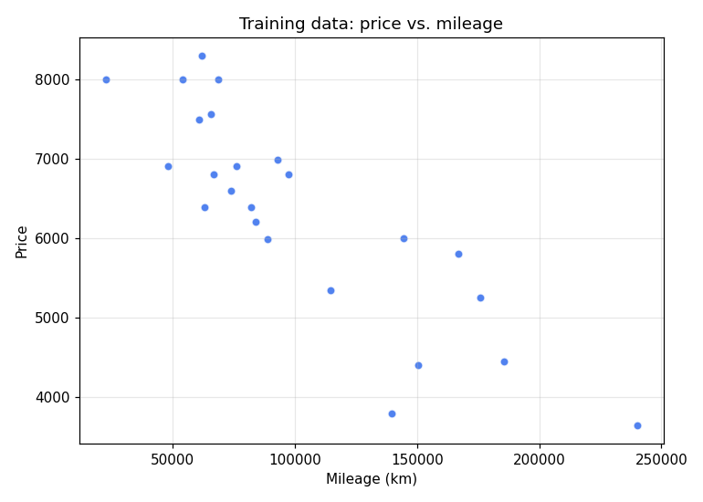
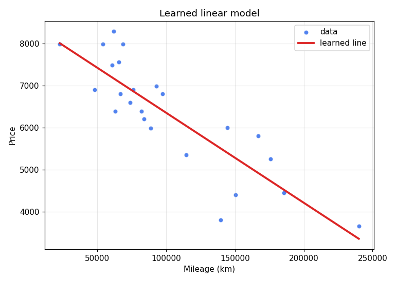
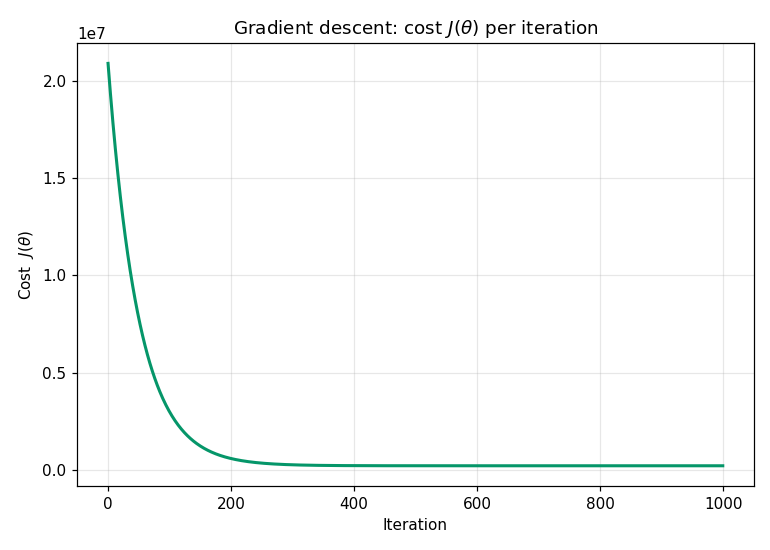

# Car Price Prediction — Linear Regression from Scratch

Predict a used car's price from its mileage using **single-variable linear regression**, trained with **batch gradient descent**. No scikit-learn — just NumPy and the raw math, so you can see exactly how the model learns.

This README is written to teach the **core logic**. If you're building the same thing, read it top to bottom and you'll understand every line.

---

## The idea in one sentence

Fit a straight line `price = a · mileage + b` to the data by repeatedly nudging `a` and `b` in the direction that reduces the average squared error.

| The data | The line we learn |
|---|---|
|  |  |

More mileage, lower price — a roughly linear trend. The model's whole job is to find the single straight line that sits closest to those points.

---

## The math (exactly as implemented)

### 1. Hypothesis — the line we fit

```python
def model(X, theta):
    return X.dot(theta)
```

We pack the parameters into a vector and the inputs into a matrix so a single dot product computes predictions for **every** sample at once:

```
h(X) = X · θ

X = [ x₁  1 ]        θ = [ θ₀ ]        →   h(xᵢ) = θ₀·xᵢ + θ₁
    [ x₂  1 ]            [ θ₁ ]
    [ ⋮   ⋮ ]
```

- `θ₀` (`theta[0]`) is the **slope**, `θ₁` (`theta[1]`) is the **intercept** (bias).
- The column of `1`s is the trick that lets one matrix multiply produce `slope·x + intercept`. Without it, the line is forced through the origin.

### 2. Cost function — how wrong we are

```python
def cost_function(X, y, theta):
    m = len(y)
    return (1/(2*m)) * np.sum((model(X, theta) - y)**2)
```

```
J(θ) = (1 / 2m) · Σ (h(xᵢ) − yᵢ)²
```

Mean squared error. The `2` in the denominator isn't statistics — it's there so the derivative comes out clean (the `2` from the square cancels it).

### 3. Gradient — which way is downhill

```python
def grad(X, y, theta):
    m = len(y)
    prediction_error = model(X, theta) - y
    gradient = (1/m) * X.T.dot(prediction_error)
    return gradient
```

```
∇J(θ) = (1 / m) · Xᵀ · (h(X) − y)
```

`Xᵀ · error` is the heart of it: it correlates each feature with the residuals, producing one gradient component per parameter (slope and intercept) in a single matrix multiply.

### 4. Gradient descent — learning

```python
def gradient_descente(X, y, theta, learning_rate, iterations):
    for _ in range(iterations):
        gradient = grad(X, y, theta)
        theta = theta - learning_rate * gradient
    return theta
```

```
θ := θ − α · ∇J(θ)        repeated `iterations` times
```

- `α` (**learning rate**) = `0.01` — step size. Too big diverges (NaN/inf — the code guards against this and raises); too small crawls.
- `iterations` = `1000` — fixed budget, no early stopping.

You can *watch* it work: plotting the cost `J(θ)` after each step shows the classic gradient-descent curve — a steep early drop as it finds the rough slope, then a long flattening as it fine-tunes. Here it falls from ~20.9M to ~0.22M.



---

## Why normalization is the part people get wrong

Mileage values are huge (~89,000–240,000 km). Feed those raw into gradient descent and the slope's gradient dwarfs the intercept's, so a learning rate that's stable for one blows the other up. Fix: **z-score standardization** before training.

```python
mean_x = np.mean(x)
std_x  = np.std(x)
x = (x - mean_x) / std_x          # now mean ≈ 0, std ≈ 1
```

```
x_norm = (x − μ) / σ
```

**The consequence that trips everyone up:** `theta` is now learned on the *normalized* scale. So you must save `μ` and `σ` alongside `theta`, and apply the **exact same** transform to any new input before predicting. That's why the saved model is three things, not one:

```json
{ "theta": [slope, intercept], "mean_x": μ, "std_x": σ }
```

---

## Prediction (denormalize → apply the line)

```python
def predict_price(mileage, theta, mean_x, std_x):
    normalized_mileage = (mileage - mean_x) / std_x   # same transform as training
    x = np.array([[normalized_mileage, 1]])           # same [x, 1] layout
    price = x.dot(theta)                              # slope·x_norm + intercept
    return price[0][0]
```

The two non-negotiables: **(1)** normalize the input with the *training* `μ`/`σ`, **(2)** append the `1` so the matrix shapes match. Skip either and the number is garbage.

> ⚠️ Linear regression **extrapolates blindly**. The training data spans ~89k–240k km, so asking for 5,000 km projects the line far outside anything it ever saw and can return a nonsensical (even negative) price. That's expected behavior, not a bug.

---

## Files

| File | Responsibility |
|------|----------------|
| `train.py` | Load CSV → plot → normalize → add bias column → run gradient descent → save params. Core functions: `get_data`, `model`, `cost_function`, `grad`, `gradient_descente`. |
| `predict.py` | Load saved params → prompt for mileage → normalize → predict. Functions: `load_parameters`, `predict_price`. |
| `data.csv` | Training data, two columns: `km,price` (header skipped via `skiprows=1`). |
| `.model_parameters.json` | Persisted model: `theta` (`[slope, intercept]`), `mean_x`, `std_x`. |

---

## Run it

```bash
python3 -m venv venv && source venv/bin/activate
pip install numpy matplotlib

python train.py      # learns θ, writes .model_parameters.json + diagnostic PNGs
python predict.py    # prompts: "Enter the car mileage:"  →  prints estimated price
```

Training prints the learned `Final theta: [[slope] [intercept]]` and saves it. Prediction reloads it and applies the line.

The graphs above are regenerated from the data and the saved model with `python make_plots.py` (writes `assets/`), so they always match the real numbers.

---

## Build-it-yourself checklist

1. Load `(x, y)` from CSV; reshape to column vectors.
2. Standardize `x` with `(x − μ)/σ`; **keep `μ` and `σ`**.
3. Append a column of `1`s to `x` → shape `(m, 2)`.
4. Init `theta = zeros((2, 1))`.
5. Loop `iterations` times: `theta -= α · (1/m)·Xᵀ·(Xθ − y)`.
6. Save `theta`, `μ`, `σ`.
7. To predict: normalize the input with the saved `μ`/`σ`, append `1`, dot with `theta`.

That's the entire algorithm. Everything else is plotting and I/O.
